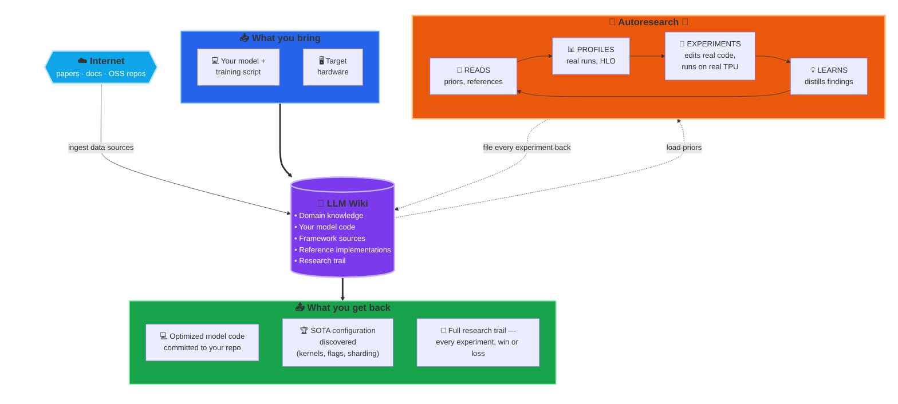

# 🤖 TPU Model Performance Auto-optimization

I'd like to make a very bold statement: given a sufficiently capable LLM, the right profiling tools, and a knowledge base that includes the model's + framework's source, an autonomous agent can drive any (model, hardware) pair to state-of-the-art performance for that combination.

If you think about this, conceptually same applicable to the engineers (can extrapolate to a new-grad without practical experience) we need **tools** (xprof), **knowledge base** (TPU optimization information), **code base** to work with, and **reference optimized code base** as bonus to be be able optimize models.

Anthropic recently published an article on recursive self improvment, where the claim is that: In the future, agents could become capable enough to build and train models themselves: https://www.anthropic.com/institute/recursive-self-improvement

For performance model optimization, which is a different but, but nevertherless extremely complex and deep domain it is already possible, at least partially.

Here is a repo that proves and demonstrates that all of that is possible already: https://github.com/vlasenkoalexey/tpu_performance_autoresearch_wiki

This project started as an experiment with Andrey Karpathy's [LLM gist](https://gist.github.com/karpathy/442a6bf555914893e9891c11519de94f) and [autoresearch optimization loop](https://github.com/karpathy/autoresearch). But when all components were connected together it become obvious that it is something larger than just auto-optimization loop. LLMs are great, and can help a lot, and can do a decent job in optimizing model. But what is most important is that it puts engineer in the optimization loop allowing orchestrating optimization process and fully leveraging the power of LLM agents.

Let's dive deep into the setup and ideas behind it.

## The Core Components

### 🔁 Autoresearch — specialized to TPU perf

[Autoresearch](https://github.com/karpathy/autoresearch) - is a methodology for letting an LLM agent run an open-ended research program: propose ranked hypotheses, run experiments, evaluate outcomes, revise priors, feed what it learned into the next round. The methodology is domain-agnostic, and can be used to optimize to the any desirable outcome as long as it can be measured. In the context of the original research paper it demonstrated how to optimize model training efficiency (from convergence / validation loss perspective). But instead it can be modified to optimize model performance (increase TPS/MFU). 
In practice this is a prompt that gives model instructions to loop through following:

- Start model with profiling
- Collect profile
- Collect metrics, including metrics that we are optimizing for (TPS/MFU)
- Analyze profile
- Come up with the hypothesis what can be done to improve performance
  - Do a minimal model code change to implement hypothesis
  - If model performance improves, keep experiment and build further ones on top of it
  - If model performance doesn’t improve, reject experiment and move further

### 🔌 Xprof MCP — profiling as a first-class LLM capability

Unlike optimizing for convergence which gets better for whatever reasons that are hard to predict, optimizing model performance is highly predictable and measurable. In order for it to work efficiently, LLM has to be able to profile models and analyze profiles. For TPU performance optimization engineers are relying on [**XProf**](https://github.com/openxla/xprof) to do that job. Also that is not suitable for LLMs, the common way to bridge this gap would be by building and MCP server, which is what I did for this project: https://github.com/vlasenkoalexey/xprof-mcp

XProf MCP gives LLM agent ability to look into the details of how model is running on TPU, where bottlenecks are, and based on that come up with ideas on how to improve it. Besides pure xprof features it also exposes an API to access **HLO dumps** — produced when the trainer is launched with [`XLA_FLAGS="--xla_dump_to=<dir> --xla_dump_hlo_as_text"`](https://openxla.org/xla/flags_guidance) — which lets the LLM connect profile information back to the [**optimized HLO**](https://openxla.org/xla/architecture#xla_the_tensorflow_compiler_framework) (what XLA actually executes on the TPU, after layout assignment, fusion, scheduling, collective-fusion, and remat passes) and to the [**original HLO**](https://openxla.org/xla/operation_semantics) (the IR the framework — JAX or torchax — emitted before XLA's optimization passes ran). From there the LLM can backtrace the original HLO back to the line of model code that produced it.

Xprof MCP allows to close the feedback loop between the idea that agent come up with, and how that idea actually works.

### 🧠 LLM Wiki — collection of domain knowledge on TPU optimization

Out of the box, an LLM's knowledge of TPU performance is limited, it has a rough sense of FLOPs, attention, and general ML training, but not much sense of XLA optimization passes, or the quirks of any particular Pallas kernel. This is usually solved by leveraging RAG - ingesting relevant data in a vector database and later on each LLM request is enriched with data relevant to the topics that request contains. That is exactly how MaxCode and MaxKernel are built for solving specific problems of converting PyTorch model to JAX and Cuda kernels to Pallas: https://github.com/AI-Hypercomputer/accelerator-agents

Setting this infrastructure is not trivial, and there is a more straightforward lightweight alternative popularized by Karpathy in his [**LLM wiki gist**](https://gist.github.com/karpathy/442a6bf555914893e9891c11519de94f)

Idea is to give LLM instructions to follow predefined structure that contains immutable raw data sources, and generated LLM Agent updated wiki pages. The user drops raw information under raw data sources, instructs an agent to “inject” data and LLM produces structured wiki pages that contain extracted concepts, links to other concepts and links back to original data sources. The process is somewhat similar to ingestion into a vector database in RAG analogy, but here the produced artifacts are pure markdown files. 
Once such LLM wiki is produced, it is similar to light-RAG, all you need to do to leverage it is to instruct an agent to consult wiki during hypothesis generation.

Ingestion can be as low-lift as "find every public reference to Pallas TPU kernels, catalog them by repo, backend, stability, and claimed performance improvements, and add the result to the wiki" — which is exactly how this repo's [Pallas kernel directory](https://github.com/vlasenkoalexey/tpu_performance_autoresearch_wiki/blob/main/wiki/analyses/2026-04-23-pallas-kernel-directory.md) was built, surveying ~200 kernels across ~30 OSS repos and indexing them by function. The payoff is leverage on every subsequent run: when the agent is scoring optimization hypotheses later, it already knows which Pallas kernels exist in the ecosystem, which are production-grade, and how to apply them — no re-discovery, no hallucinating kernels that don't exist.

Once injested data is formatted as a regular markdown files that are human readable and searchable. [Obsidian](https://obsidian.md/) is often used to inspect and navigate such wikis, and it has a cool graph view that visualizes knowledge nodes (concepts) and edges (connections) between them:

### 💻 Your model codebase — what LLM can actually change and optimize

he model code you want to optimize rarely exists in isolation — it lives inside a larger training framework your team owns or forks, like [TorchTitan](https://github.com/pytorch/torchtitan). The wiki structure adapts naturally: add the framework as a git submodule under `raw/code/<slug>`, pin the commit you ingested, and let the agent edit it in place on per-experiment branches. Each experiment is a real diff on a real branch — auditable, revertable, and tied back to the experiment page that produced it, the profile that justified it, and the verdict that accepted or rejected it.

For demonstration purposes experiment code lives as part of the wiki: https://github.com/vlasenkoalexey/tpu_performance_autoresearch_wiki/tree/main/wiki/experiments

This is the part that distinguishes this setup from "LLM as smart reader." The agent gets **write access** to the model code, not just read access. It can swap an attention kernel, tune a batch size, restructure remat, flip an XLA flag, and then measure whether it actually helped — all under the autoresearch protocol that makes the change reviewable. There are multiple ways to wire this up (submodule, sibling clone, monorepo subdir), and no single right way — pick the one that matches how your team already version-controls the model.

### 🏆 State of the art repos — optimization reference

The setup so far is enough for the agent to optimize your model on its own — but you can shortcut a lot of the search by handing it a working reference for what "fast on TPU" actually looks like. Ingest a state-of-the-art TPU codebase alongside your own and the optimization question changes shape: instead of *"explore the space of possible optimizations,"* it becomes *"figure out why this reference model is fast, why mine is slow, and close the gap."* That's a much narrower, much more tractable search.

Concrete references worth ingesting: for TPU training, [MaxText](https://github.com/AI-Hypercomputer/maxtext) and [MaxDiffusion](https://github.com/AI-Hypercomputer/maxdiffusion); for inference, [vLLM](https://github.com/vllm-project/vllm) and [SGLang](https://github.com/sgl-project/sglang) (both have first-class TPU backends). Once these are in the wiki — kernels cataloged, sharding strategies indexed, XLA flags noted — the agent has a concrete target to compare against, not just a space of abstract hypotheses.

And the agent can go further than reading code. It can actually **run** the reference model, profile it through the same xprof MCP it uses for your own model, and read its HLO and op-level breakdown side-by-side with yours. From there it can attribute the gap concretely — different attention kernels, different fusion patterns, different sharding or remat strategies, different XLA flags — and turn each gap item into a falsifiable hypothesis on your own model. That short-circuits a large chunk of the search: many "what should I try next?" decisions collapse into "do what the fast reference already does, and measure."

### ⚙️ Your framework's codebase — going even deeper

Optional, but useful: ingest the framework your model is built on. The dominant choice on TPU is [JAX](https://github.com/jax-ml/jax), but PyTorch-on-TPU paths matter too — [PyTorch/XLA](https://github.com/pytorch/xla), [torchax](https://github.com/pytorch/xla/tree/master/torchax), and the [TorchTPU](https://developers.googleblog.com/torchtpu-running-pytorch-natively-on-tpus-at-google-scale/) (coming soon) work. With the framework in the wiki, the agent can resolve crash stacktraces all the way down to the framework internals, reason about *why* a particular dispatch path emitted the HLO it did, and propose fixes that touch the framework boundary rather than just the model code. This is where the deeper bugs and the deeper wins tend to live — not in your model file, but in how it is executed by your framework, how it is lowered to StableHLO, and how XLA optimizes and executes StableHLO.

## Combining components together

If we put everything together, we are conceptually giving LLM Agent same skills and capabilities performance engineer needs to be able to successfully tune model performance:
- Vast knowledge base about TPU model performance optimization
- Access to profiling tool
- Information about how to build and run each model
- Information about how to build and run underlying model framework

Once you tell agent to start experiment loop it automatically coming up with ideas, changes model code, runs models on TPU, document findings and repeats the loop.

And beyond that each hypothesis and experiment is being logged and cataloged so it can be referred to and leveraged in the future. As a result we get a **self-improving** optimization agent that learns as it is being used.

 Every experiment it runs — winners *and* losers — is filed back into the wiki as a permanent piece of context: what was tried, what worked, what didn't, and *why*. The next hypothesis is scored against that growing record, so a refuted experiment in week one shapes the ranked list in week ten; a generalizable lesson extracted from one failed run ("scan-over-layers needs an internally-tiled attention kernel") becomes a prior the agent applies automatically the next time scan comes up. The longer it runs, the smarter it gets — not because the model is updating, but because the wiki is.

## Generalization comment

This repo extends the original autoresearch idea into a more general architecture: **autoresearch is an optimization loop** that proposes ranked, falsifiable experiments; **the wiki is a knowledge base** of domain information that informs hypothesis generation and experiment design (papers, codebases, concepts, and the running record of what's been tried); and **the MCP server is an observer / feedback loop** that grounds each iteration in real signal. 

But same idea can be applicable to **any** optimization problem that requires a **domain knowledge** that LLM don't generally help, **optimization objective** that LLM can iterate on, and a **feedback mechanism**.

## Experiment case study

Everything is just a theory until we have data to prove it. To demonstrate that this approach worked we performed an experiment to optimize Llama3 8b model on TPU v6e8. Model is small and extremely well studied, doesn't take a lot of time to run, so iteration speed can be fast.
There is also an optimized version in [MaxText repo](https://github.com/AI-Hypercomputer/tpu-recipes/tree/main/training/trillium/Llama3.1-8B-MaxText/v6e-8) that we can compare it to.

Model definition was generated from scratch by LLM in a 2 step process:
1. Instruct LLM to take [HuggingFace LLama3](https://huggingface.co/meta-llama/Meta-Llama-3-8B) model implementation and convert it to torchax. Then I run optimization loop on torchax for ~70 iterations.
2. Once it become clear that we got to a local maximum for optimizing torchax model, I told LLM to rewrite model in Jax and run optimization loop for ~70 iterations.

Experiment was performed using Claude Code with Opus 4.7 on high effort setting (default).

Results are following:

| Stack | Best config | tok/s/chip | MFU | vs MaxText | Reference experiment |
|-------|-------------|-----------:|----:|-----------:|----------------------|
| 🏆 **JAX (Flax NNX)** | bs=4, full MaxText XLA stack + SC offload of AR/RS/AG + tokamax-splash w/ base2/fuse_recip/mlc=30 + tokamax CE chunked_xla + scan/`nothing_saveable` | **~7,700** (peak 7,768) | **~43.3 %** (peak 43.6 %) | **+8.9 %** (peak +9.9 %) | [JAX exp 27/28b](jax/experiments/2026-04-26-jax-exp27-28-sparsecore-rs-ag-offload-frontier.md) |
| MaxText reference | bs=3, `tpu-recipes-v0.1.4` recipe `llama3_1_8b_8192_no_collective_matmul` (host-offload of activations + custom remat + AR-only SC offload) | 7,069 | 44.6 % | — (anchor) | [MaxText baseline](maxtext/experiments/2026-04-25-maxtext-llama3-1-8b-v6e8-baseline.md) |
| torchax (PyTorch-on-JAX) | bs=3, scan + tokamax CE chunked_xla + tokamax-splash w/ base2/fuse_recip/mlc=30 + AMP fp32-master | 6,559 | 36.8 % | -7.2 % | [torchax exp 72a/74b](torchax/experiments/2026-04-26-exp72a-tokamax-splash-bs3-seq8k-accepted.md) |
| torchax (morning baseline) | bs=2 seq=1024, no scan/tokamax, plain AMP | 4,591 | 22.9 % (at seq=1024) | — | [torchax baseline](torchax/experiments/2026-04-25-baseline.md) |

In a weekend agent was able to get to the state of the art performance for simple model.
The whole experiment trail is available here: https://github.com/vlasenkoalexey/tpu_performance_autoresearch_wiki/tree/main/wiki/experiments/llama3_8B_autoresearch_optimization

## Caveats

1. At least in original setup, optimization loop only worked well on Claude Code. Both GPT-5.5 in Codex and Gemini 3.1 Pro in Gemini CLI struggled to make a progress. This problem is already fixed, more updates are coming.
2. I had to baby-sit optimization loop because it stopped quite often and complained that it can't do further optimizations. I did a 'gentle' steering by asking it to explore specific topic on few occastions, but didn't modify any code myself. There is at least a partial solution for this problem as well, will publish it in the future.
3. Auto-optimization doesn't work as well for more complex models, but it doesn't mean that approach is not useful. 

## Closing thoughts

Main value of this methodology, at least at the moment is coming from the fact that it puts **YOU** as an engineer in the driver seat to steer the optimization process. You don't have to write any code manually, you don't have to write docker containers and run them on GKE, you don't have to inspect logs and parse results. You just tell what agent should do for you. That's where the productivity boost is coming from.