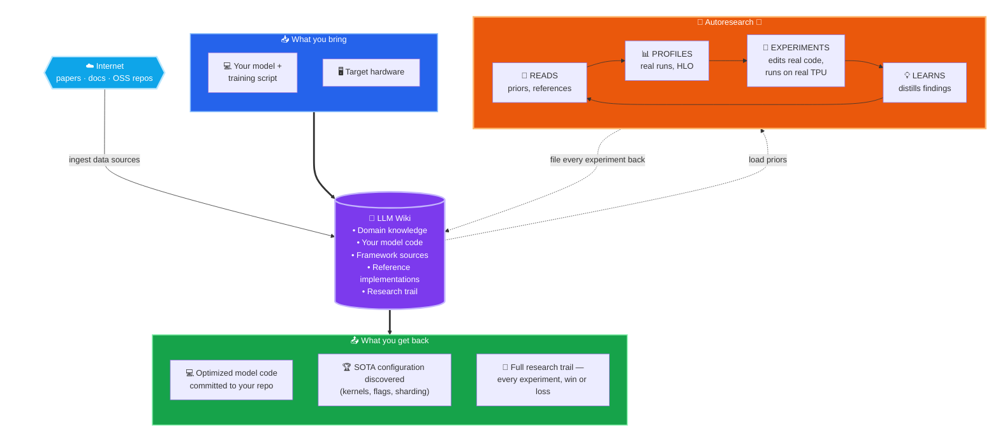

I'd like to make a bold statement: given a sufficiently capable LLM, the right profiling tools, and a knowledge base that includes the model's + framework's source, an autonomous agent can drive any (model, hardware) pair to state-of-the-art performance for that combination.

The same is conceptually true for engineers — assuming a new hire without hands-on experience in the model-optimization domain would need the same four things to optimize models: **tools** (XProf), a **knowledge base** (TPU optimization know-how), a **codebase** to work on, and, as a bonus, a **reference-optimized codebase**.

Anthropic recently published an article on recursive self-improvement, with the claim that in the future, agents could become capable enough to build and train models themselves: <https://www.anthropic.com/institute/recursive-self-improvement>

For model performance optimization — a different but nevertheless extremely complex domain — this is already possible, at least partially.

Here is a repo that proves and demonstrates that all of that is possible already: <https://github.com/vlasenkoalexey/tpu_performance_autoresearch_wiki>

This project started as an experiment with Andrej Karpathy's [LLM gist](https://gist.github.com/karpathy/442a6bf555914893e9891c11519de94f) and [autoresearch optimization loop](https://github.com/karpathy/autoresearch). But once all the components were connected together, it became obvious that this is something larger than just an auto-optimization loop. LLMs are great and can do a decent job optimizing models, but what matters most is that this puts the engineer in the optimization loop, orchestrating the process and fully leveraging the power of LLM agents.

Let's dive deep into the setup and ideas behind it.

## The Core Components

### 🔁 Autoresearch — specialized to TPU perf

[Autoresearch](https://github.com/karpathy/autoresearch) is a methodology for letting an LLM agent run an open-ended research program: propose ranked hypotheses, run experiments, evaluate outcomes, revise priors, and feed what it learned into the next round. The methodology is domain-agnostic and can be used to optimize for any desirable outcome as long as it can be measured. The original work demonstrated optimizing model training efficiency (from a convergence / validation-loss perspective), but it can be repurposed to optimize model performance instead — increasing **TPS** (tokens/sec) and **MFU** (Model FLOPs Utilization).

In practice this is a prompt that gives the model instructions to loop through the following:

- Start model with profiling
- Collect profile
- Collect metrics, including metrics that we are optimizing for (TPS/MFU)
- Analyze profile
- Come up with the hypothesis what can be done to improve performance
  - Do a minimal model code change to implement hypothesis
  - If model performance improves, keep experiment and build further ones on top of it
  - If model performance doesn’t improve, reject experiment and move further

### 🔌 Xprof MCP — profiling as a first-class LLM capability

Unlike optimizing for convergence — which improves for reasons that are hard to predict — optimizing model performance is highly predictable and measurable. For it to work efficiently, the LLM has to be able to profile models and analyze the profiles. For TPU performance optimization, engineers rely on [**XProf**](https://github.com/openxla/xprof) to do that job. But XProf isn't directly usable by an LLM; the common way to bridge that gap is to build an MCP server, which is what I did for this project: <https://github.com/vlasenkoalexey/xprof-mcp>

XProf MCP gives the LLM agent the ability to look into the details of how the model is running on TPU, where the bottlenecks are, and based on that come up with ideas on how to improve it. Besides pure xprof features it also exposes an API to access **HLO dumps** — produced when the trainer is launched with [`XLA_FLAGS="--xla_dump_to=<dir> --xla_dump_hlo_as_text"`](https://openxla.org/xla/flags_guidance) — which lets the LLM connect profile information back to the [**optimized HLO**](https://openxla.org/xla/architecture#xla_the_tensorflow_compiler_framework) (what XLA actually executes on the TPU, after layout assignment, fusion, scheduling, collective-fusion, and remat passes) and to the [**original HLO**](https://openxla.org/xla/operation_semantics) (the IR the framework — JAX or torchax — emitted before XLA's optimization passes ran). From there the LLM can backtrace the original HLO back to the line of model code that produced it.

XProf MCP closes the feedback loop between the idea the agent comes up with and how that idea actually performs.

### 🧠 LLM Wiki — collection of domain knowledge on TPU optimization

Out of the box, an LLM's knowledge of TPU performance is limited — it has a rough sense of FLOPs, attention, and general ML training, but not much sense of XLA optimization passes or the quirks of any particular Pallas kernel. This is usually solved by leveraging RAG - ingesting relevant data in a vector database and later on each LLM request is enriched with data relevant to the topics that request contains. That is exactly how MaxCode and MaxKernel are built for solving specific problems of converting PyTorch model to JAX and Cuda kernels to Pallas: <https://github.com/AI-Hypercomputer/accelerator-agents>

Setting up this infrastructure is not trivial, and there is a more straightforward, lightweight alternative popularized by Karpathy in his [**LLM wiki gist**](https://gist.github.com/karpathy/442a6bf555914893e9891c11519de94f).

The idea is to have the LLM follow a predefined structure containing immutable raw data sources plus agent-generated wiki pages. The user drops raw information under the raw data sources, instructs an agent to “ingest” it, and the LLM produces structured wiki pages that contain extracted concepts, links to other concepts, and links back to the original data sources. The process is loosely analogous to ingestion into a vector database in RAG, but here the produced artifacts are plain markdown files. 
Once such LLM wiki is produced, it is similar to light-RAG, all you need to do to leverage it is to instruct an agent to consult wiki during hypothesis generation.

Ingestion can be as low-lift as "find every public reference to Pallas TPU kernels, catalog them by repo, backend, stability, and claimed performance improvements, and add the result to the wiki" — which is exactly how this repo's [Pallas kernel directory](https://github.com/vlasenkoalexey/tpu_performance_autoresearch_wiki/blob/main/wiki/analyses/2026-04-23-pallas-kernel-directory.md) was built, surveying ~200 kernels across ~30 OSS repos and indexing them by function. The payoff is leverage on every subsequent run: when the agent is scoring optimization hypotheses later, it already knows which Pallas kernels exist in the ecosystem, which are production-grade, and how to apply them — no re-discovery, no hallucinating kernels that don't exist.

The ingested data is plain markdown — human-readable and searchable. [Obsidian](https://obsidian.md/) is often used to inspect and navigate such wikis, with a nice graph view that visualizes knowledge nodes (concepts) and the edges (connections) between them. Click the image below for a live, interactive visualization of what the current wiki knowledge base looks like:

### 💻 Your model codebase — what LLM can actually change and optimize

The model code you want to optimize rarely exists in isolation — it lives inside a larger training framework your team owns or forks, like [TorchTitan](https://github.com/pytorch/torchtitan). The wiki structure adapts naturally: add the framework as a git submodule under `raw/code/<slug>`, pin the commit you ingested, and let the agent edit it in place on per-experiment branches. Each experiment is a real diff on a real branch — auditable, revertable, and tied back to the experiment page that produced it, the profile that justified it, and the verdict that accepted or rejected it.

For demonstration purposes experiment code lives as part of the wiki: <https://github.com/vlasenkoalexey/tpu_performance_autoresearch_wiki/tree/main/wiki/experiments>

This is the part that distinguishes this setup from "LLM as smart reader." The agent gets **write access** to the model code, not just read access. It can swap an attention kernel, tune a batch size, restructure remat, flip an XLA flag, and then measure whether it actually helped — all under the autoresearch protocol that makes the change reviewable. There are multiple ways to wire this up (submodule, sibling clone, monorepo subdir), and no single right way — pick the one that matches how your team already version-controls the model.

### 🏆 State of the art repos — optimization reference

The setup so far is enough for the agent to optimize your model on its own — but you can shortcut a lot of the search by handing it a working reference for what "fast on TPU" actually looks like. Ingest a state-of-the-art TPU codebase alongside your own and the optimization question changes shape: instead of *"explore the space of possible optimizations,"* it becomes *"figure out why this reference model is fast, why mine is slow, and close the gap."* That's a much narrower, much more tractable search.

Concrete references worth ingesting: for TPU training, [MaxText](https://github.com/AI-Hypercomputer/maxtext) and [MaxDiffusion](https://github.com/AI-Hypercomputer/maxdiffusion); for inference, [vLLM](https://github.com/vllm-project/vllm) and [SGLang](https://github.com/sgl-project/sglang) (both have first-class TPU backends). Once these are in the wiki — kernels cataloged, sharding strategies indexed, XLA flags noted — the agent has a concrete target to compare against, not just a space of abstract hypotheses.

And the agent can go further than reading code. It can actually **run** the reference model, profile it through the same xprof MCP it uses for your own model, and read its HLO and op-level breakdown side-by-side with yours. From there it can attribute the gap concretely — different attention kernels, different fusion patterns, different sharding or remat strategies, different XLA flags — and turn each gap item into a falsifiable hypothesis on your own model. That short-circuits a large chunk of the search: many "what should I try next?" decisions collapse into "do what the fast reference already does, and measure."

### ⚙️ Your framework's codebase — going even deeper

Optional, but useful: ingest the framework your model is built on. The dominant choice on TPU is [JAX](https://github.com/jax-ml/jax), but PyTorch-on-TPU paths matter too — [PyTorch/XLA](https://github.com/pytorch/xla), [torchax](https://github.com/pytorch/xla/tree/master/torchax), and the [TorchTPU](https://developers.googleblog.com/torchtpu-running-pytorch-natively-on-tpus-at-google-scale/) (coming soon) work. With the framework in the wiki, the agent can resolve crash stacktraces all the way down to the framework internals, reason about *why* a particular dispatch path emitted the HLO it did, and propose fixes that touch the framework boundary rather than just the model code. This is where the deeper bugs and the deeper wins tend to live — not in your model file, but in how it is executed by your framework, how it is lowered to StableHLO, and how XLA optimizes and executes StableHLO.

## Combining components together

If we put everything together, we are conceptually giving the LLM agent the same skills and capabilities a performance engineer needs to successfully tune model performance:
- Vast knowledge base about TPU model performance optimization
- Access to profiling tool
- Information about how to build and run each model
- Information about how to build and run underlying model framework

Once you tell the agent to start the experiment loop, it automatically comes up with ideas, changes the model code, runs the model on TPU, documents findings, and repeats the loop.

And beyond that each hypothesis and experiment is being logged and cataloged so it can be referred to and leveraged in the future. As a result we get a **self-improving** optimization agent that learns as it is being used.

 Every experiment it runs — winners *and* losers — is filed back into the wiki as a permanent piece of context: what was tried, what worked, what didn't, and *why*. The next hypothesis is scored against that growing record, so a refuted experiment in week one shapes the ranked list in week ten; a generalizable lesson extracted from one failed run ("scan-over-layers needs an internally-tiled attention kernel") becomes a prior the agent applies automatically the next time scan comes up. The longer it runs, the smarter it gets — not because the model is updating, but because the wiki is.





## Generalization comment

This repo extends the original autoresearch idea into a more general architecture: **autoresearch is an optimization loop** that proposes ranked, falsifiable experiments; **the wiki is a knowledge base** of domain information that informs hypothesis generation and experiment design (papers, codebases, concepts, and the running record of what's been tried); and **the MCP server is an observer / feedback loop** that grounds each iteration in real signal. 

But the same idea applies to **any** optimization problem that has **domain knowledge** an LLM doesn't generally have, an **optimization objective** the LLM can iterate on, and a **feedback mechanism**.

## Experiment case study

Everything is just theory until we have data to prove it. We ran two case studies on TPU v6e-8: first **Llama 3 8B** — a single-harness deep optimization that pushed one model to state of the art — and then **Qwen3 8B** — a head-to-head comparing several agent + harness combinations turned loose on the same model.

### Llama 3 8B

To demonstrate that the approach works, we ran an experiment optimizing the Llama 3 8B model on TPU v6e-8. The model is small and extremely well studied and doesn't take long to run, so iteration speed is fast.
There is also an optimized version in [MaxText repo](https://github.com/AI-Hypercomputer/tpu-recipes/tree/main/training/trillium/Llama3.1-8B-MaxText/v6e-8) that we can compare it to.

Model definition was generated from scratch by LLM in a 2 step process:
1. Instruct the LLM to take the [Hugging Face Llama 3](https://huggingface.co/meta-llama/Meta-Llama-3-8B) implementation and convert it to torchax. I then ran the optimization loop on torchax for ~70 iterations.
2. Once it became clear we had hit a local maximum for the torchax model, I told the LLM to rewrite the model in JAX and ran the optimization loop for another ~70 iterations.

Experiment was performed using Claude Code with Opus 4.7 on high effort setting (default).

Results are following:

| Stack | tok/s/chip | MFU | vs MaxText | Ref |
|-------|-----------:|----:|-----------:|-----|
| 🏆 **JAX (Flax NNX)** | **~7,700** (peak 7,768) | **~43.3 %** (peak 43.6 %) | **+8.9 %** (peak +9.9 %) | [exp 27/28b](https://github.com/vlasenkoalexey/tpu_performance_autoresearch_wiki/blob/main/wiki/experiments/llama3_8B_autoresearch_optimization/jax/experiments/2026-04-26-jax-exp27-28-sparsecore-rs-ag-offload-frontier.md) |
| MaxText reference | 7,069 | 44.6 % non-causal / **≈39.6 %** causal | — (anchor) | [baseline](https://github.com/vlasenkoalexey/tpu_performance_autoresearch_wiki/blob/main/wiki/experiments/llama3_8B_autoresearch_optimization/maxtext/experiments/2026-04-25-maxtext-llama3-1-8b-v6e8-baseline.md) |
| torchax (PyTorch-on-JAX) | 6,559 | 36.8 % | −7.2 % | [exp 72a/74b](https://github.com/vlasenkoalexey/tpu_performance_autoresearch_wiki/blob/main/wiki/experiments/llama3_8B_autoresearch_optimization/torchax/experiments/2026-04-26-exp72a-tokamax-splash-bs3-seq8k-accepted.md) |
| torchax (baseline) | 4,591 | 22.9 % @ seq=1024 | — | [baseline](https://github.com/vlasenkoalexey/tpu_performance_autoresearch_wiki/blob/main/wiki/experiments/llama3_8B_autoresearch_optimization/torchax/experiments/2026-04-25-baseline.md) |

Best config per row:

- **JAX (Flax NNX)** — bs=4, full MaxText XLA stack + SC offload of AR/RS/AG + tokamax-splash w/ base2/fuse_recip/mlc=30 + tokamax CE chunked_xla + scan/`nothing_saveable`
- **MaxText reference** — bs=3, `tpu-recipes-v0.1.4` recipe `llama3_1_8b_8192_no_collective_matmul` (host-offload of activations + custom remat + AR-only SC offload)
- **torchax (PyTorch-on-JAX)** — bs=3, scan + tokamax CE chunked_xla + tokamax-splash w/ base2/fuse_recip/mlc=30 + AMP fp32-master
- **torchax (baseline)** — bs=2 seq=1024, no scan/tokamax, plain AMP

A note on the MFU column: the MaxText reference reports MFU on a **non-causal** FLOP basis — the `tpu-recipes-v0.1.4` recipe we ran predates MaxText's causal-attention `÷2` fix — while our JAX and torchax lanes count causal FLOPs. On the same causal basis the MaxText reference is **≈39.6 %**, so the JAX lane (43.3 %) actually leads on MFU too. The `vs MaxText` column compares **tokens/sec/chip**, which is convention-free and unaffected by this difference (hence the JAX lane's +8.9 % there). See [caveats](#caveats).

Over a weekend, the agent reached state-of-the-art performance for this simple model.
The whole experiment trail is available here: <https://github.com/vlasenkoalexey/tpu_performance_autoresearch_wiki/tree/main/wiki/experiments/llama3_8B_autoresearch_optimization>

Click the image below to open the interactive experiment explorer — toggle the JAX vs torchax lanes, switch between MFU and TPS, hide crashed runs, and click any point to open the underlying experiment page:

### Qwen3 8B (update as of 06/15/2026)

The Llama 3 8B run used a single harness (Claude Code). For the next case study we asked a different question: **how do different agents and harnesses compare when each is set loose on the same model, fully autonomously?** We ran [Qwen3 8B](https://huggingface.co/Qwen/Qwen3-8B) on the same TPU v6e-8 with four agent + harness combinations — Claude Code (Opus 4.8), Claude Code (Fable 5), Codex (GPT-5.5), and Antigravity (Gemini 3.1 pro) — with no steering instructions. The only nudge was eventually pointing each agent at the MaxText repo as a reference.

Best result per harness at seq 8192, measured as causal-adjusted MFU and compared against the MaxText reference normalized to the same causal FLOP accounting (see [caveats](#caveats)):

| Agent + harness | Best MFU @ seq 8192 | vs MaxText |
|-----------------|--------------------:|-----------:|
| 🏆 **Codex (GPT-5.5)** | **43.2 %** | **+8.5 %** |
| **Claude Code (Fable 5)** | **39.9 %** | **+0.3 %** |
| MaxText reference (causal-adjusted) | 39.8 % | — (anchor) |
| Claude Code (Opus 4.8) | 34.8 % | −12.6 % |
| Antigravity (Gemini 3.1 pro) | 30.6 % | −23.1 % |

At least Codex (GPT-5.5) and Fable 5 autonomously surpassed the optimized MaxText reference; Claude Opus 4.8 and Gemini 3.1 pro trailed it in this round. The interesting result isn't any single number — it's that several different agent + harness stacks can now each drive the loop end-to-end without hand-holding, and that the spread between them is itself a measurement.

There are a lot of interesting nuances to explore from these experiments. It seems that Codex did the best here simply because it didn't bail out like other models regarding of instructions and kept pushing to run more experiments. The conclusion is that every model requires some amount of special handling to achieve best results, and the goal of this experiment is not to demonstrate which model works better, but rather to prove that approach can be adapted to work with any resonably intelligent model.

Click the image below to open the interactive experiment explorer — toggle per-harness lanes, switch between MFU and TPS, hide crashed runs, and click any point to open the underlying experiment page:

The full per-harness experiment trail lives under the `qwen3_cc` / `qwen3_cc5` / `qwen3_cx` / `qwen3_ag` folders here: <https://github.com/vlasenkoalexey/tpu_performance_autoresearch_wiki/tree/main/wiki/experiments>

## Caveats

1. At least in the original setup, the optimization loop only worked well on Claude Code. Both GPT-5.5 in Codex and Gemini 3.1 Pro in Gemini CLI struggled to make progress - **fixed as of 06/15/2026**.
2. I had to babysit the optimization loop because it stopped fairly often, complaining that it couldn't optimize further. I did some 'gentle' steering by asking it to explore a specific topic on a few occasions, but didn't modify any code myself. There's at least a partial solution to this as well, which I'll publish in the future - [**fixed as of 06/05/2026**]().
3. Auto-optimization doesn't work as well for more complex models yet — but that doesn't mean the approach isn't useful.

## Closing thoughts

The main value of this methodology, at least right now, comes from the fact that it puts **YOU**, the engineer, in the driver's seat to steer the optimization process. You don't have to write any code manually, you don't have to build Docker containers and run them on GKE, and you don't have to inspect logs and parse results — you just tell the agent what to do. That's where the productivity boost comes from.