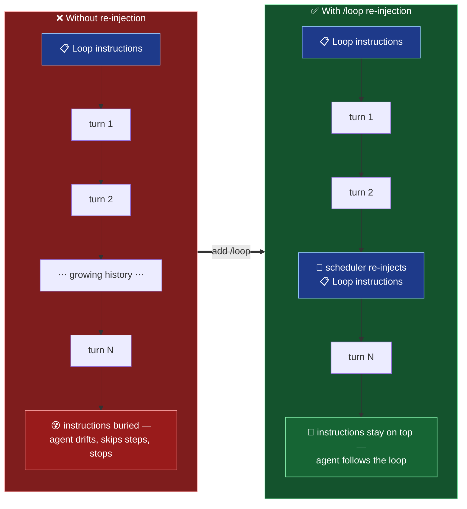
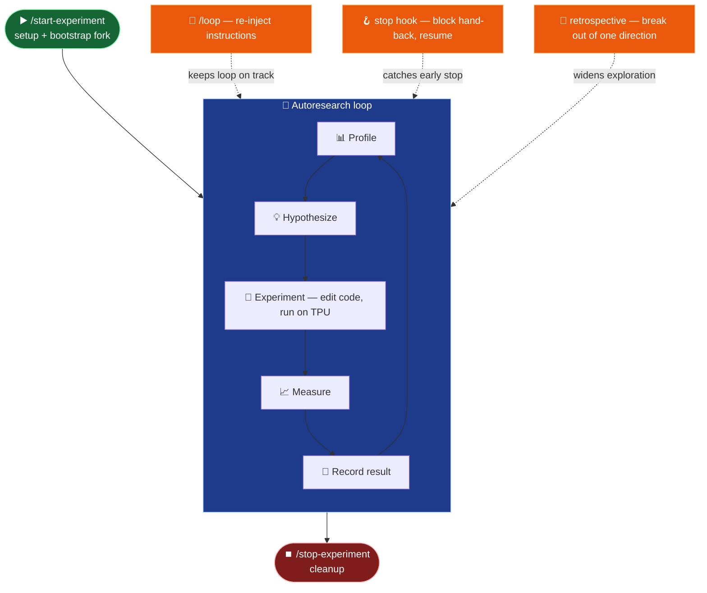

Andrej Karpathy's [autoresearch](https://github.com/karpathy/autoresearch) is a
genuinely brilliant idea. I was able to adapt it to the model-performance-optimization domain, and it proved to work in its original form — see my earlier write-up on
[TPU model performance auto-optimization]().

That post also flagged some issues, though. The loop needed some babysitting: the model would complain that it couldn't make further progress, claim it had exhausted all ideas, or simply stop to ask for confirmation on a trivial action.

[Autoresearch prompt](https://github.com/karpathy/autoresearch/blob/master/program.md) has a snippet explicitly telling the model it should never stop — a snippet I really like:
> **NEVER STOP:** Once the experiment loop has begun (after the initial setup), do NOT pause to ask the human if you should continue. Do NOT ask "should I keep going?" or "is this a good stopping point?". The human might be asleep, or gone from a computer and expects you to continue working indefinitely until you are manually stopped. You are autonomous. If you run out of ideas, think harder — read papers referenced in the code, re-read the in-scope files for new angles, try combining previous near-misses, try more radical architectural changes. The loop runs until the human interrupts you, period.
>
> As an example use case, a user might leave you running while they sleep. If each experiment takes you ~5 minutes then you can run approx 12/hour, for a total of about 100 over the duration of the average human sleep. The user then wakes up to experimental results, all completed by you while they slept!
{: .prompt-tip }

And nevertheless, it did stop, complain, and ask for permission. Same as working with engineers 🙂

Before getting into the details, I'd like to highlight that this is not a critique of the autoresearch work — it's the practical solution I ended up using to solve these problems and productionize the autoresearch loop for my specific use case. Autoresearch is perfect in its simplicity: it's a minimal repo meant to demonstrate an idea, and it doesn't need the bells and whistles that would otherwise distract from the main point 💡

## 📖 Background

When I first demoed the auto-optimization repo, some people were confused. Where's the code that's supposed to run here? The whole repo is just a collection of markdown files — how is it even supposed to work?

In the end, everything is just a prompt for an LLM, and everything we're doing here is clever prompt engineering. That's what Andrej Karpathy calls [Software 3.0](https://www.youtube.com/watch?v=LCEmiRjPEtQ).

- Software 1.0 is writing traditional programs.
- Software 2.0 is training models to solve specific problems — object detection, for example; this is roughly how ML was evolving before ChatGPT became mainstream.
- Software 3.0 is a prompt, or a collection of prompts, given to an LLM agent, usually running in an agentic harness like Claude Code, Codex, or Gemini CLI.

With this distinction in mind we can now see that Software 1.0 and Software 3.0 have different properties.

Software 1.0 is deterministic and rigid: it does exactly what it was coded to do. It's totally possible to code an autoresearch loop using traditional code, and that would solve the auto-stop problem. But should we? Non-determinism in such an autoresearch loop is a feature, not a bug.

Another important distinction is that with Software 3.0 it's often easy to get something working — one of the reasons AI prototypes are popping up left and right. But it's much harder to make it work reliably, measure its performance, and find ways to improve it.

With that in mind, let's explore the problems the autoresearch loop had in my TPU model auto-optimization framework, and how they were addressed — or at least mitigated.

## 🤪 Agent not following instructions

Complaining, asking for permission, and stopping the optimization process are all symptoms of one problem: context pollution. Once I started investigating what was going on, it turned out the model was often skipping steps — not collecting profiles, doing blind flag sweeps, not properly generating reports, diverging from the instructions because it decided it knew better.

What's happening is that the model always has the loop instructions in its context. When you start the optimization loop, those instructions are at the top of the context, and the model treats them as the highest priority. But as the conversation goes on, the autoresearch instructions get pushed deeper and deeper down. The context window for modern LLMs is pretty large — around 1M tokens for Opus 4.8 — so why should the model pay attention to that tiny snippet of instructions compared to everything else it has since accumulated on top of it?





_Loop instructions start at the top of the context, then sink as the conversation grows; `/loop` periodically pushes them back to the top._

The fix is simple: force the model to keep the instructions at the top of the context window. This has to be an external mechanism, independent of the model's own loop (otherwise it can just ignore the instruction to re-read). What I ended up with is a scheduler that periodically pushes the autoresearch loop instructions back on top of the context — the same as if you manually told the model to re-read the instructions. All harnesses support this now; in Claude Code you do it with the `/loop` skill.

To automate this for every new experiment I came up with [`/start-experiment`](https://github.com/vlasenkoalexey/tpu_performance_autoresearch_wiki/blob/main/.claude/skills/start-experiment/SKILL.md) and [`/stop-experiment`](https://github.com/vlasenkoalexey/tpu_performance_autoresearch_wiki/blob/main/.claude/skills/stop-experiment/SKILL.md) skills. 

All preparation and validation logic moved to `/start-experiment`, and it also initializes `/loop` to force auto-research loop reload, and starts iteration itself. `/stop-experiment` stops loops, and performs cleanup.

This is a heavy-handed solution that obviously wastes tokens, and maybe there's a better one — like using traditional code to orchestrate the optimization process. But it's good enough, and honestly tokens shouldn't be a concern with auto-optimization anyway; it's going to burn a lot of them regardless.

## 🛑 Agent stopping early

As with the previous problem, there are clear instructions for the agent to never stop the optimization process — but even with /loop in place, it still does. The fix here is simple, at least for Claude Code, which supports [stop hooks](https://code.claude.com/docs/en/hooks). When the LLM tries to pass control back to the user, the stop hook is triggered. A minor inconvenience is that stop hooks are global and affect all sessions — but since they can run arbitrary code, you can filter by session so the hook's logic only triggers for the specific session you care about. As with `/loop`, the `/start-experiment` skill can optionally register a stop hook for long-running optimization processes. See the implementation here: <https://github.com/vlasenkoalexey/tpu_performance_autoresearch_wiki/blob/main/.claude/stop_hook.sh>

<!-- TODO screenshot: the stop hook firing and pushing the agent back into the loop. Embed:  -->

## 🔭 Agent narrowing down to one specific direction

The agent often complained that it had exhausted all ideas and couldn't make progress. In some sense that could be true: if the agent is doing a flag sweep over one hyperparameter, then once it has tried every value that makes sense, it can reasonably say it's done. It was a common problem that the agent spent a lot of time exploring one area while completely ignoring others. By analogy with engineering work: if you get too deep into a problem and get stuck, it's a good idea to step back and review your data at a higher level. The same applies to models. Extending the stop-hook idea, you can write any instruction into the stop hook to be returned to the agent.
To step back, you can tell the agent to do a retrospective over all the experiments it has run so far, check which areas it explored in depth, and pick areas that might still have gaps. This can be coded as a skill — see the [`/create-retrospective`](https://github.com/vlasenkoalexey/tpu_performance_autoresearch_wiki/blob/main/.claude/skills/create-retrospective/SKILL.md) skill, which is bundled into the stop hook. The skill itself can also be invoked manually at any time.

## 🔀 Parallelizing research

The original autoresearch solution assumes a single optimization loop running. In my case, the codebase I worked with had multiple models, and it was natural to run separate loops for each. But because of the way autoresearch is set up — a new branch per experiment — running them directly would clobber each other's branches. I first tried running separate forks of the whole repo, but that was wasteful and inconvenient.

I experimented with a few approaches:

- One clever orchestrator managing branches and running the optimization loop, with dumb workers executing instructions — didn't scale, because of context pollution.
- One dumb orchestrator only managing branches, with clever workers running their own optimization loops — this worked, but you'd end up needing a dashboard to track every worker.
- Fork/copy the repo into the experiment folder and run a separate optimization session per model — this is what I ended up using.

The logic for bootstrapping a per-experiment fork is baked into the `/start-experiment` skill. The main repo being modified lives under `/raw/code/<repo_name>`. Once an experiment starts, that repo is copied to `/wiki/experiment/<experiment_name>/<experiment_lane>/.repo/<repo_name>`. With this in place, it no longer matters what the top branch in the main repo is — each session manipulates code in its own copy. Only successful experiments are merged back into the main repo.

This is a bit wasteful in that we copy the whole repo for each experiment, but disk space is cheap, and we can drop the local copy once the experiment is complete.

## 🧩 Putting it together

Each fix is a small external guardrail around the same autoresearch loop — `/loop` keeps the instructions on top, the stop hook catches early exits, and the retrospective breaks the agent out of a rut:





## 🏁 Closing thoughts

With these tweaks to the process, I was able to leave the auto-optimization loop running for many hours without supervision. If you plan to run any version of an autoresearch loop, you'll most likely need something similar.

That said, these tweaks still didn't get Codex or Gemini CLI to run the loop reliably — I'll cover the fix for that in a separate post. So this is an incremental step, not the final solution.